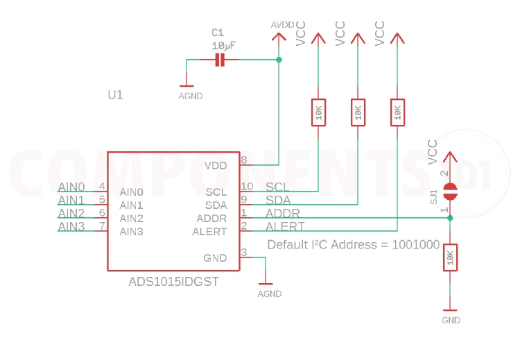
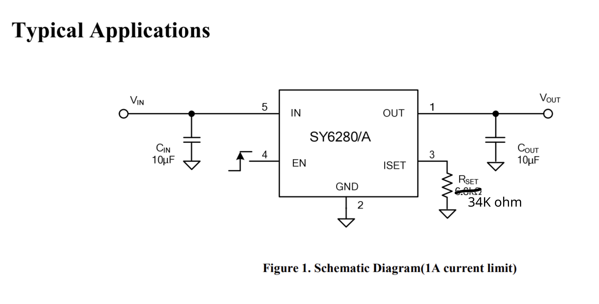
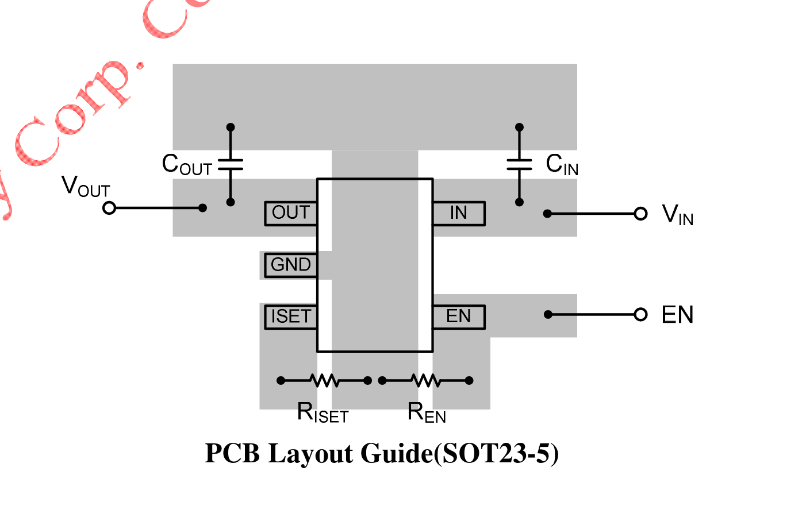

# Hardware Specification Document
## Raspberry Pi Sensor Control Shield

**Document Version:** 1.0  
**Date:** 2024  
**Purpose:** Complete hardware specification for hardware developer

---

## 1. Project Overview

### 1.1 Project Purpose
This board is a **Raspberry Pi Shield** that provides safe, clean, and immediately usable interfaces for sensors, GPIO, and common buses. It eliminates breadboards, loose wires, and guesswork from hardware testing and prototyping.

### 1.2 Design Philosophy
- **Simple over clever**: Straightforward, reliable functionality
- **Safe by default**: Hardware-enforced protection and current limiting
- **Clean physical structure**: Proper connectors, organized layout
- **Instant feedback**: Visual confirmation of connections and states

### 1.3 Key Features
- Controlled sensor power rail (3.3V, software-controlled)
- 4-channel analog-to-digital converter (ADC)
- Multiple JST-GH connectors for I²C, SPI, UART, GPIO, LEDs, buttons
- Current-limited outputs for LED control
- Button inputs with proper pull-up configuration
- Shared ground plane across all connectors

---

## 2. System Architecture

### 2.1 High-Level Block Diagram

```
Raspberry Pi 40-pin Header
    │
    ├── 3.3V Power ──┐
    │                 │
    ├── GPIO26 ───────┼──> Load Switch (SY6280AAC) ──> SENS_3V3_SW (Sensor Power Rail)
    │                 │
    ├── I2C1 (SDA/SCL) ──> I2C Ports (J12, J13) + ADC (ADS1015)
    │
    ├── SPI0 ──────────> SPI Port (J15)
    │
    ├── UART ──────────> UART Port (J14)
    │
    ├── GPIO ──────────> LED Outputs (J1-J4), Buttons (J5-J6), GPIO Bank (J11)
    │
    └── GND ───────────> Shared Ground Plane
```

### 2.2 Power Domains
- **3V3_IN**: 3.3V from Raspberry Pi (input to load switch)
- **SENS_3V3_SW**: Switched 3.3V sensor power rail (output from load switch)
- **GND**: Shared ground plane

### 2.3 Bus Interfaces
- **I²C1**: Primary I²C bus (BCM2/3) - shared by ADC and I2C ports
- **SPI0**: SPI bus (BCM8-11)
- **UART**: UART interface (BCM14/15)

---

## 3. Component Specifications

### 3.1 Analog-to-Digital Converter (ADC) - FINALIZED

**Part:** ADS1015IDGST  
**Manufacturer:** Texas Instruments  
**LCSC Part Number:** C37593 (verify current availability)  
**Package:** VSSOP-10 (DGST)

**Specifications:**
- **Interface:** I²C (address 0x48, default)
- **Channels:** 4 single-ended or 2 differential
- **Resolution:** 12-bit (4096 steps)
- **Input Range:** 0V to VDD (3.3V)
- **Sampling Rate:** Programmable (128 SPS to 3.3 kSPS)
- **Supply Voltage:** 2.0V to 5.5V (operating from 3.3V)
- **Programmable Gain Amplifier (PGA):** ±6.144V, ±4.096V, ±2.048V, ±1.024V, ±0.512V, ±0.256V

**Supporting Components:**
- **C_ADC** (C_ADC): 0.1µF decoupling capacitor (0402/0603)
  - Placement: At ADS1015 VDD pin
  - Purpose: Supply decoupling
- **R_ADDR** (R_ADDR): Address configuration (optional)
  - Can use solder jumper with pull-up/pull-down resistors to set I2C address
  - Default address: 0x48 (ADDR pin to GND)

**Design Notes:**
- Place ADC in analog island (isolated from digital noise)
- Keep analog routing quiet and away from digital signals
- RC filter recommended per ADC channel (not in base BOM, add as needed)
- I2C pull-up resistors (typically 10kΩ) may be needed on SDA/SCL if not present on Pi
- Address configuration via ADDR pin: GND = 0x48, VDD = 0x49, SDA = 0x4A, SCL = 0x4B

**Reference Designator:** U_ADC

**ADC Choice Assessment:**

The **ADS1015** is an excellent choice for this application:

**Advantages:**
- **12-bit resolution (4096 steps)** provides ~0.8mV resolution at 3.3V range - more than sufficient for most sensor applications
- **Higher sampling rate (up to 3.3 kSPS)** compared to ADS1115 (860 SPS) - better for faster signal acquisition
- **Lower cost** - typically more economical than 16-bit alternatives
- **Integrated PGA** - flexible input range selection without external amplification
- **Same I2C interface** - drop-in replacement consideration, same address scheme
- **Lower power consumption** - beneficial for battery-powered or low-power applications
- **Proven reliability** - widely used in industry applications

**Trade-offs:**
- Lower resolution than ADS1115 (12-bit vs 16-bit), but 12-bit is adequate for most sensor monitoring tasks
- For precision measurements requiring <1mV accuracy, 16-bit might be preferred, but for general sensor monitoring, 12-bit is sufficient

**Recommendation:** ✅ **ADS1015 is well-suited for this project** - provides excellent performance-to-cost ratio and meets all requirements for sensor voltage monitoring applications.

**Schematic Reference:**



*Figure 1: ADS1015 Typical Application Circuit - Shows power connections, analog inputs (AIN0-AIN3), I2C interface (SDA/SCL), address configuration, and decoupling capacitor placement.*

---

### 3.2 Load Switch / eFuse - FINALIZED

**Part:** SY6280AAC  
**Manufacturer:** Silergy  
**LCSC Part Number:** C55136  
**Package:** SOT-23-5

**Key Features:**
- Programmable current limit (via external resistor)
- Reverse blocking capability
- Enable control (GPIO-driven)
- Low on-resistance
- Thermal protection

**Specifications:**
- **Input Voltage:** 2.5V to 5.5V (operating from 3.3V)
- **Current Limit:** Programmable via RSET resistor
- **Current Limit Formula:** Ilim ≈ 6800 / Rset (kΩ)
- **Fixed Current Limit:** 200mA (RSET = 34.0kΩ)
- **Enable Logic:** Active HIGH (EN = HIGH enables output)

**UPDATED Configuration Requirements:**
- **Default State:** ON by default (EN pulled HIGH via pull-up resistor)
- **Jumper Option:** Jumper to force OFF by default (pulls EN LOW)
- **Current Limit:** Fixed at 200mA (no adjustable option)
- **GPIO Control:** GPIO26 (BCM26, physical pin 37) can override enable state

**Supporting Components:**

1. **RSET1** (RSET1): 34.0kΩ 1% resistor (0603 or 0402)
   - **Purpose:** Sets current limit to 200mA
   - **Calculation:** Ilim = 6800 / 34.0 = 200mA
   - **Nets:** SENS_ILIM to GND
   - **Status:** PROD (required)

2. **REN_PU** (REN_PU): 100kΩ pull-up resistor (0603)
   - **Purpose:** Pulls EN HIGH for default ON state
   - **Nets:** SENS_EN to 3V3_IN (or SENS_3V3_SW if available before switch)
   - **Status:** PROD (required)
   - **Note:** Changed from original pulldown - now pullup for default ON

3. **REN_SER** (REN_SER): 100Ω series resistor (0603)
   - **Purpose:** Optional but recommended for edge/ESD protection
   - **Nets:** SENS_EN_GPIO26 to SENS_EN
   - **Status:** PROD (recommended)

4. **SJ_OFF** (SJ_OFF): 2-pad solder jumper
   - **Purpose:** Jumper to force OFF by default (shorts EN to GND)
   - **Configuration:** 
     - OPEN: Default ON (EN pulled HIGH via REN_PU)
     - CLOSED: Forces OFF (EN pulled LOW, overrides pull-up)
   - **Status:** PROD (optional feature)

5. **CIN** (CIN): 10µF 6.3V+ X5R/X7R capacitor (0805/1206)
   - **Purpose:** Input bulk/decoupling capacitor
   - **Placement:** Close to U_SENS_SW IN pin
   - **Nets:** 3V3_IN to GND
   - **Status:** PROD (required)

6. **COUT** (COUT): 10µF 6.3V+ X5R/X7R capacitor (0805/1206)
   - **Purpose:** Output bulk/decoupling capacitor
   - **Placement:** Close to U_SENS_SW OUT pin and near sensor connectors
   - **Nets:** SENS_3V3_SW to GND
   - **Status:** PROD (required)

**Removed Components (Not Needed):**
- **RSET2**: Parallel resistor for 300mA mode - REMOVED (fixed at 200mA)
- **SJ_ILIM**: Solder jumper for current limit selection - REMOVED (no adjustable limit)

**Pin Assignment:**
- **Pin 1 (IN):** 3V3_IN
- **Pin 2 (GND):** GND
- **Pin 3 (EN):** SENS_EN (via REN_SER from GPIO26, pulled HIGH by REN_PU, jumper SJ_OFF can force LOW)
- **Pin 4 (ILIM):** SENS_ILIM (via RSET1 to GND)
- **Pin 5 (OUT):** SENS_3V3_SW

**Reference Designator:** U_SENS_SW

**Load Switch Decision - FINALIZED:**

**SY6280AAC (LCSC: C55136)** has been selected and locked in as the final choice.

**Rationale:**
- ✅ **Availability in JLCpcb Basic Library (C55136)** - no additional sourcing costs
- ✅ **Programmable current limit** - meets 200mA requirement perfectly
- ✅ **Reverse blocking capability** - critical for sensor protection
- ✅ **Proven design** - well-documented, reliable operation
- ✅ **SOT-23-5 package** - compact, standard footprint
- ✅ **Active HIGH enable** - matches default ON requirement with pull-up

**Schematic Reference:**



*Figure 2: SY6280AAC Typical Application Circuit (200mA current limit) - Shows input/output connections, enable control, current limit resistor (RSET = 34kΩ for 200mA), and decoupling capacitors (CIN, COUT = 10µF).*

**PCB Layout Reference:**



*Figure 3: SY6280AAC PCB Layout - Shows recommended component placement and routing for the load switch circuit.*

---

## 4. Connector Specifications

All connectors use **JST-GH series** for reliable, professional connections. All connectors are **surface-mount (SMT)** and placed along board edges for clean cabling.

### 4.1 Connector Part Numbers

**Primary Connector (2-pin, 4-pin, 6-pin):**
- **LCSC Part Number:** C22436166
- **Manufacturer:** Hong Cheng
- **Part Number:** HC-PM254-8.5H-2x20PS
- **Type:** 2.54mm pitch, dual-row, SMD receptacle/socket
- **Usage:** Pi Shield connector (SMT on bottom per spec)
- **Used for:** J1-J13, J15 (LEDs, Buttons, ADC, GPIO Bank, I2C Ports, SPI)

**UART Connector (3-pin):**
- **LCSC Part Number:** C161691
- **Manufacturer:** JST
- **Part Number:** BM03B-GHS-TBT(LF)(SN)
- **Type:** 3-wire connector (GND + 2 signals)
- **Used for:** J14 (UART0)

### 4.2 Connector Pin Assignments

#### J1 - LED1 (2-pin)
| Pin | Signal | Pi GPIO | Physical Pin | Notes |
|-----|--------|---------|--------------|-------|
| 1 | LED1_SIG | BCM16 | 36 | Via current-limit resistor |
| 2 | GND | - | - | Ground |

#### J2 - LED2 (2-pin)
| Pin | Signal | Pi GPIO | Physical Pin | Notes |
|-----|--------|---------|--------------|-------|
| 1 | LED2_SIG | BCM17 | 11 | Via current-limit resistor |
| 2 | GND | - | - | Ground |

#### J3 - LED3 (2-pin)
| Pin | Signal | Pi GPIO | Physical Pin | Notes |
|-----|--------|---------|--------------|-------|
| 1 | LED3_SIG | BCM27 | 13 | Via current-limit resistor |
| 2 | GND | - | - | Ground |

#### J4 - LED4 (2-pin)
| Pin | Signal | Pi GPIO | Physical Pin | Notes |
|-----|--------|---------|--------------|-------|
| 1 | LED4_SIG | BCM22 | 15 | Via current-limit resistor |
| 2 | GND | - | - | Ground |

**LED Design Notes:**
- Drive as GPIO outputs
- LED polarity handled by LED wiring
- Current-limiting resistors required (not in base BOM - add per application)

#### J5 - BTN1 (2-pin)
| Pin | Signal | Pi GPIO | Physical Pin | Notes |
|-----|--------|---------|--------------|-------|
| 1 | BTN1_IN | BCM23 | 16 | Configure internal pull-up |
| 2 | GND | - | - | Ground |

**Button Design Notes:**
- Configure GPIO with internal pull-up
- Pressed = GND (active LOW)

#### J6 - BTN2 (2-pin)
| Pin | Signal | Pi GPIO | Physical Pin | Notes |
|-----|--------|---------|--------------|-------|
| 1 | BTN2_IN | BCM24 | 18 | Configure internal pull-up |
| 2 | GND | - | - | Ground |

#### J7 - ADC0 (2-pin)
| Pin | Signal | Pi GPIO | Physical Pin | Notes |
|-----|--------|---------|--------------|-------|
| 1 | ADS1015_AIN0 | - | - | Connect to ADC channel 0 |
| 2 | GND | - | - | Ground |

**ADC Channel Design Notes:**
- Keep analog routing quiet
- RC filter recommended per channel (add as needed)
- Connect to ADS1015 AINx pins

#### J8 - ADC1 (2-pin)
| Pin | Signal | Pi GPIO | Physical Pin | Notes |
|-----|--------|---------|--------------|-------|
| 1 | ADS1015_AIN1 | - | - | Connect to ADC channel 1 |
| 2 | GND | - | - | Ground |

#### J9 - ADC2 (2-pin)
| Pin | Signal | Pi GPIO | Physical Pin | Notes |
|-----|--------|---------|--------------|-------|
| 1 | ADS1015_AIN2 | - | - | Connect to ADC channel 2 |
| 2 | GND | - | - | Ground |

#### J10 - ADC3 (2-pin)
| Pin | Signal | Pi GPIO | Physical Pin | Notes |
|-----|--------|---------|--------------|-------|
| 1 | ADS1015_AIN3 | - | - | Connect to ADC channel 3 |
| 2 | GND | - | - | Ground |

#### J11 - GPIO_BANK (4-pin)
| Pin | Signal | Pi GPIO | Physical Pin | Notes |
|-----|--------|---------|--------------|-------|
| 1 | GPIO1 | BCM5 | 29 | General purpose I/O |
| 2 | GPIO2 | BCM6 | 31 | General purpose I/O |
| 3 | GPIO3 | BCM12 | 32 | General purpose I/O |
| 4 | GPIO4 | BCM13 | 33 | General purpose I/O |

**GPIO Bank Design Notes:**
- No GND on this connector
- Use GND from any other port

#### J12 - I2C_PORT_A (4-pin)
| Pin | Signal | Pi GPIO | Physical Pin | Notes |
|-----|--------|---------|--------------|-------|
| 1 | SENS_3V3_SW | - | - | Switched sensor rail |
| 2 | GND | - | - | Ground |
| 3 | SDA (I2C1) | BCM2 | 3 | I²C data line |
| 4 | SCL (I2C1) | BCM3 | 5 | I²C clock line |

**I2C Port Design Notes:**
- Switched sensor rail (default ON, jumper/software control)
- Shared I2C1 bus with ADC

#### J13 - I2C_PORT_B (4-pin)
| Pin | Signal | Pi GPIO | Physical Pin | Notes |
|-----|--------|---------|--------------|-------|
| 1 | SENS_3V3_SW | - | - | Switched sensor rail |
| 2 | GND | - | - | Ground |
| 3 | SDA (I2C1) | BCM2 | 3 | I²C data line |
| 4 | SCL (I2C1) | BCM3 | 5 | I²C clock line |

#### J14 - UART0 (3-pin)
| Pin | Signal | Pi GPIO | Physical Pin | Notes |
|-----|--------|---------|--------------|-------|
| 1 | GND | - | - | Ground |
| 2 | TXD (Pi → device) | BCM14 | 8 | UART transmit |
| 3 | RXD (device → Pi) | BCM15 | 10 | UART receive |

#### J15 - SPI0 (6-pin)
| Pin | Signal | Pi GPIO | Physical Pin | Notes |
|-----|--------|---------|--------------|-------|
| 1 | SENS_3V3_SW | - | - | Switched sensor rail |
| 2 | GND | - | - | Ground |
| 3 | SCLK | BCM11 | 23 | SPI clock |
| 4 | MOSI | BCM10 | 19 | SPI master out |
| 5 | MISO | BCM9 | 21 | SPI master in |
| 6 | CS0 | BCM8 | 24 | SPI chip select 0 |

---

## 5. Pin Mapping and GPIO Assignments

### 5.1 Raspberry Pi GPIO to Board Function Mapping

| Function | Signal Name | BCM GPIO | Physical Pin | Direction | Notes |
|----------|-------------|----------|--------------|-----------|-------|
| Sensor Switch Enable | SENS_EN | BCM26 | 37 | Output | Controls load switch (default ON, jumper/software override) |
| LED1 | LED1_SIG | BCM16 | 36 | Output | Via current-limit resistor |
| LED2 | LED2_SIG | BCM17 | 11 | Output | Via current-limit resistor |
| LED3 | LED3_SIG | BCM27 | 13 | Output | Via current-limit resistor |
| LED4 | LED4_SIG | BCM22 | 15 | Output | Via current-limit resistor |
| Button 1 | BTN1_IN | BCM23 | 16 | Input | Internal pull-up, active LOW |
| Button 2 | BTN2_IN | BCM24 | 18 | Input | Internal pull-up, active LOW |
| I2C1 SDA | SDA | BCM2 | 3 | I/O | Shared by ADC and I2C ports |
| I2C1 SCL | SCL | BCM3 | 5 | I/O | Shared by ADC and I2C ports |
| GPIO1 | GPIO1 | BCM5 | 29 | I/O | GPIO bank |
| GPIO2 | GPIO2 | BCM6 | 31 | I/O | GPIO bank |
| GPIO3 | GPIO3 | BCM12 | 32 | I/O | GPIO bank |
| GPIO4 | GPIO4 | BCM13 | 33 | I/O | GPIO bank |
| UART TXD | TXD | BCM14 | 8 | Output | UART transmit |
| UART RXD | RXD | BCM15 | 10 | Input | UART receive |
| SPI CS0 | CS0 | BCM8 | 24 | Output | SPI chip select |
| SPI MISO | MISO | BCM9 | 21 | Input | SPI master in |
| SPI MOSI | MOSI | BCM10 | 19 | Output | SPI master out |
| SPI SCLK | SCLK | BCM11 | 23 | Output | SPI clock |

### 5.2 Power and Ground Connections

| Function | Signal Name | Source | Notes |
|----------|-------------|--------|-------|
| 3.3V Input | 3V3_IN | Raspberry Pi pin 1 or 17 | Input to load switch |
| Sensor Power | SENS_3V3_SW | Load switch output | Switched 3.3V rail |
| Ground | GND | Raspberry Pi multiple pins | Shared ground plane |

### 5.3 Special Considerations

**Analog Routing:**
- ADC channels (AIN0-AIN3) must be routed in analog island
- Keep away from digital signals and power switching
- Consider RC filtering on each ADC input (not in base BOM)

**Power Routing:**
- Bulk capacitors (CIN, COUT) must be placed close to load switch
- COUT should also be near sensor connectors
- Use adequate trace width for 200mA current capability

**Ground Plane:**
- Continuous ground plane recommended
- Connect all GND pins to ground plane
- Separate analog and digital grounds if needed (star ground at Pi connector)

---

## 6. Power Management

### 6.1 Power Input
- **Source:** Raspberry Pi 3.3V rail (pin 1 or 17)
- **Signal:** 3V3_IN
- **Current Capability:** Limited by Pi's 3.3V rail (typically 50-200mA available)
- **Note:** Load switch limits sensor rail to 200mA, protecting Pi's 3.3V rail

### 6.2 Switched Sensor Power Rail
- **Signal:** SENS_3V3_SW
- **Source:** Load switch output (U_SENS_SW)
- **Voltage:** 3.3V (regulated by load switch)
- **Current Limit:** Fixed at 200mA
- **Default State:** ON by default
- **Control Methods:**
  1. **Hardware Jumper (SJ_OFF):** Closes to force OFF (pulls EN LOW)
  2. **Software Control (GPIO26):** Can override to enable/disable
  3. **Default (No Jumper, No Software):** ON (EN pulled HIGH by REN_PU)

### 6.3 Enable Control Circuit

**Default ON Configuration:**
```
3V3_IN ──[REN_PU 100k]── SENS_EN ──[REN_SER 100Ω]── GPIO26
                              │
                              │
                         [SJ_OFF] (OPEN = ON, CLOSED = OFF)
                              │
                             GND
```

**Operation:**
- **Jumper OPEN (default):** REN_PU pulls EN HIGH → Load switch ON
- **Jumper CLOSED:** EN pulled LOW → Load switch OFF (overrides pull-up)
- **GPIO26 HIGH:** Can drive EN HIGH (if jumper open) → Load switch ON
- **GPIO26 LOW:** Can drive EN LOW → Load switch OFF (overrides pull-up)

### 6.4 Current Limiting Configuration

**Fixed 200mA Limit:**
- **RSET1:** 34.0kΩ 1% resistor
- **Formula:** Ilim = 6800 / Rset (kΩ) = 6800 / 34.0 = 200mA
- **No adjustable option:** Fixed at 200mA (RSET2 and SJ_ILIM removed)

### 6.5 Power-On Sequence
1. Raspberry Pi powers on, 3.3V rail available
2. Load switch enable defaults to HIGH (via REN_PU) → SENS_3V3_SW turns ON
3. If jumper SJ_OFF is closed, EN is forced LOW → SENS_3V3_SW stays OFF
4. Software can control via GPIO26 to override default state

---

## 7. PCB Layout Guidelines

### 7.1 Component Placement

**Load Switch Section:**
- Place U_SENS_SW (load switch) near power input
- CIN (10µF) immediately adjacent to load switch IN pin
- COUT (10µF) immediately adjacent to load switch OUT pin and near sensor connectors
- RSET1 (34.0kΩ) close to ILIM pin
- REN_PU, REN_SER, SJ_OFF near EN pin for easy access

**ADC Section:**
- Place U_ADC (ADS1015) in analog island (isolated from digital)
- C_ADC (0.1µF) at VDD pin of ADC
- Keep ADC channels (AIN0-AIN3) away from digital signals
- Route ADC channels with minimal length, avoid crossing digital traces

**Connectors:**
- Place all connectors along board edges
- SMT connectors on bottom side (per spec)
- Group related connectors (e.g., I2C ports together)
- Ensure adequate clearance for cable routing

### 7.2 Power Routing

**3V3_IN Routing:**
- Use adequate trace width (minimum 0.5mm for 200mA)
- Route to load switch IN, ADC VDD, and other 3.3V consumers
- Place CIN close to load switch

**SENS_3V3_SW Routing:**
- Use adequate trace width (minimum 0.5mm for 200mA)
- Route to I2C ports (J12, J13), SPI port (J15)
- Place COUT near load switch OUT and near sensor connectors
- Consider multiple vias for current distribution

**Ground Routing:**
- Continuous ground plane recommended
- Connect all GND pins to ground plane
- Star ground at Raspberry Pi connector if separating analog/digital grounds

### 7.3 Analog Considerations

**Analog Island:**
- Isolate ADC section from digital noise
- Use ground plane separation if needed
- Keep ADC supply (3V3_IN) clean (may need additional filtering)
- Route ADC input channels away from switching signals

**ADC Input Filtering:**
- Consider RC filters on each ADC channel (not in base BOM)
- Typical: 100Ω series + 100nF to GND
- Place filters near ADC input pins

### 7.4 Digital Signal Routing

**I2C Bus:**
- Route SDA/SCL as differential pair if possible
- Keep traces short and away from switching signals
- Pull-up resistors on I2C bus (may be on Pi or external - verify)

**SPI Bus:**
- Route SPI signals (SCLK, MOSI, MISO, CS0) together
- Keep traces short
- Consider series termination resistors if traces are long

**GPIO Signals:**
- Standard digital routing
- No special requirements for LED/button/GPIO signals

### 7.5 Mechanical Considerations

**Raspberry Pi Header:**
- Standard 40-pin GPIO header (2.54mm pitch)
- Through-hole or SMT (per design choice)
- Ensure proper alignment and spacing

**Board Dimensions:**
- Standard Raspberry Pi Shield dimensions (typically 65mm x 56mm or custom)
- Mounting holes as needed for your design

---

## 8. Bill of Materials (BOM)

### 8.1 Complete Component List

| RefDes | Qty | Description | Value/Part | LCSC_PN | Mfr | Mfr_PN | Footprint | Populate | Notes |
|--------|-----|-------------|------------|---------|-----|--------|-----------|----------|-------|
| **Load Switch Section** |
| U_SENS_SW | 1 | Load switch / eFuse-lite | SY6280AAC | C55136 | Silergy | SY6280AAC | SOT-23-5 | PROD | Programmable current limit + reverse blocking |
| RSET1 | 1 | Current-limit set resistor | 34.0k 1% | - | - | - | 0603/0402 | PROD | Sets 200mA limit: Ilim≈6800/Rset |
| REN_PU | 1 | EN pull-up resistor | 100k | - | - | - | 0603 | PROD | Default ON: pulls EN HIGH |
| REN_SER | 1 | EN series resistor | 100Ω | - | - | - | 0603 | PROD | Optional but recommended (ESD/edge protection) |
| SJ_OFF | 1 | Solder jumper (OFF option) | 2-pad jumper | - | - | - | SolderJumper_2 | PROD | OPEN=ON (default), CLOSED=OFF |
| CIN | 1 | Input bulk capacitor | 10µF 6.3V+ X5R/X7R | - | - | - | 0805/1206 | PROD | Place close to U_SENS_SW IN |
| COUT | 1 | Output bulk capacitor | 10µF 6.3V+ X5R/X7R | - | - | - | 0805/1206 | PROD | Place close to U_SENS_SW OUT |
| **ADC Section** |
| U_ADC | 1 | 4ch ADC (I2C) | ADS1015IDGST | C37593 | TI | ADS1015IDGST | VSSOP-10 | PROD | Place in analog island |
| C_ADC | 1 | ADC supply decoupling | 0.1µF | - | - | - | 0402/0603 | PROD | Place at ADS1015 VDD pin |
| R_ADDR | 1 | Address strap resistor | 0Ω (or DNP) | - | - | - | 0402/0603 | LAB | Optional: only if address change needed |
| **Connectors** |
| J1-J4 | 4 | LED connectors (2-pin) | JST-GH | C22436166 | Hong Cheng | HC-PM254-8.5H-2x20PS | SMT | PROD | 2.54mm pitch, SMD receptacle |
| J5-J6 | 2 | Button connectors (2-pin) | JST-GH | C22436166 | Hong Cheng | HC-PM254-8.5H-2x20PS | SMT | PROD | 2.54mm pitch, SMD receptacle |
| J7-J10 | 4 | ADC connectors (2-pin) | JST-GH | C22436166 | Hong Cheng | HC-PM254-8.5H-2x20PS | SMT | PROD | 2.54mm pitch, SMD receptacle |
| J11 | 1 | GPIO bank (4-pin) | JST-GH | C22436166 | Hong Cheng | HC-PM254-8.5H-2x20PS | SMT | PROD | 2.54mm pitch, SMD receptacle |
| J12-J13 | 2 | I2C ports (4-pin) | JST-GH | C22436166 | Hong Cheng | HC-PM254-8.5H-2x20PS | SMT | PROD | 2.54mm pitch, SMD receptacle |
| J14 | 1 | UART (3-pin) | JST-GH | C161691 | JST | BM03B-GHS-TBT(LF)(SN) | SMT | PROD | 3-wire connector |
| J15 | 1 | SPI (6-pin) | JST-GH | C22436166 | Hong Cheng | HC-PM254-8.5H-2x20PS | SMT | PROD | 2.54mm pitch, SMD receptacle |
| **Raspberry Pi Header** |
| H1 | 1 | 40-pin GPIO header | 2.54mm pitch | - | - | - | TH/SMT | PROD | Standard Pi header |

### 8.2 Component Notes

**Population Status:**
- **PROD:** Production parts (always populate)
- **LAB:** Laboratory/prototype parts (optional, may be DNP)

**Removed Components (Not in Final Design):**
- **RSET2:** Parallel resistor for 300mA mode - REMOVED (fixed at 200mA)
- **SJ_ILIM:** Solder jumper for current limit selection - REMOVED (no adjustable limit)

**Additional Components Not in Base BOM:**
- **LED Current-Limit Resistors:** Add per LED application (typically 220Ω-1kΩ)
- **ADC Input RC Filters:** Add per channel if needed (typically 100Ω + 100nF)
- **I2C Pull-up Resistors:** Verify if needed (may be on Pi or external)

---

## 9. Design Decisions and Notes

### 9.1 Finalized Components

**ADC:**
- **ADS1015IDGST** - FINALIZED
  - 12-bit resolution, 4 channels
  - I2C interface (address 0x48, default)
  - VSSOP-10 package
  - LCSC: C37593 (verify current availability)
  - Higher sampling rate (up to 3.3 kSPS) and lower cost than 16-bit alternatives

### 9.2 Load Switch Decision - FINALIZED

**Part: SY6280AAC (LCSC: C55136)** - LOCKED IN

**Specifications:**
- Programmable current limit (200mA fixed)
- Reverse blocking capability
- SOT-23-5 package
- LCSC: C55136 (Basic Library - no additional cost)

**Configuration:**
- **Default State:** ON by default (EN pulled HIGH)
- **Jumper Option:** SJ_OFF to force OFF by default
- **Current Limit:** Fixed at 200mA (RSET1 = 34.0kΩ)
- **GPIO Control:** GPIO26 can override enable state

**Decision Rationale:**
- ✅ Available in JLCpcb Basic Library (no extra sourcing cost)
- ✅ Meets all requirements (200mA limit, reverse blocking, enable control)
- ✅ Proven, well-documented component
- ✅ Compact SOT-23-5 package
- ✅ Active HIGH enable matches default ON requirement

### 9.3 Power Management Decisions

**Sensor Power Rail:**
- Default ON for convenience (sensors powered at boot)
- Jumper option for safety (force OFF if needed)
- Software control for flexibility
- Fixed 200mA limit for protection

**Current Limit:**
- Fixed at 200mA (no adjustable option)
- Simplifies design (removes RSET2 and SJ_ILIM)
- Adequate for most sensor applications

### 9.4 Connector Decisions

**JST-GH Series:**
- Professional, reliable connectors
- 2.54mm pitch (standard)
- SMT mounting for clean assembly
- Edge placement for easy cable routing

### 9.5 Design Simplifications

**Removed Features:**
- Adjustable current limit (300mA option) - simplified to fixed 200mA
- Default OFF state - changed to default ON for convenience

**Retained Features:**
- Jumper option for OFF (safety/configuration)
- Software control via GPIO26
- Reverse blocking (load switch feature)
- Current limiting (200mA fixed)

---

## 10. Assembly Notes

### 10.1 SMT Assembly Considerations

**Component Orientation:**
- Follow datasheet pin 1 markings
- Load switch (U_SENS_SW): Verify pin 1 orientation
- ADC (U_ADC): Verify pin 1 orientation
- Connectors: Follow manufacturer orientation guidelines

**Solder Paste:**
- Standard SMT solder paste
- Ensure adequate paste for larger components (capacitors, connectors)

**Reflow Profile:**
- Follow JLCpcb standard reflow profile
- Verify temperature limits for all components

### 10.2 Component Placement Order

1. Small passives (resistors, capacitors) - 0402/0603
2. ICs (load switch, ADC) - SOT-23-5, VSSOP-10
3. Larger passives (bulk capacitors) - 0805/1206
4. Connectors - JST-GH series
5. Raspberry Pi header (if through-hole)

### 10.3 Test Points (Recommended)

Consider adding test points for:
- 3V3_IN (power input)
- SENS_3V3_SW (sensor power output)
- SENS_EN (enable signal)
- I2C bus (SDA, SCL) - for debugging
- ADC channels (AIN0-AIN3) - for verification

### 10.4 Programming/Configuration

**No Programming Required:**
- All components are hardware-configured
- ADC address is hard-wired (0x48 default)
- Load switch current limit set by resistor

**Software Configuration:**
- Configure GPIO26 for sensor switch control
- Configure GPIOs for LEDs, buttons
- Enable I2C, SPI, UART on Raspberry Pi

---

## 11. Testing Requirements

### 11.1 Power-On Sequence Verification

**Test Procedure:**
1. Apply power to Raspberry Pi
2. Measure 3V3_IN voltage (should be 3.3V ±5%)
3. Measure SENS_3V3_SW voltage:
   - **With jumper OPEN:** Should be 3.3V (default ON)
   - **With jumper CLOSED:** Should be 0V (forced OFF)
4. Verify load switch enable signal (SENS_EN):
   - **Jumper OPEN:** Should be HIGH (3.3V)
   - **Jumper CLOSED:** Should be LOW (0V)

**Expected Results:**
- 3V3_IN: 3.3V stable
- SENS_3V3_SW: 3.3V (jumper open) or 0V (jumper closed)
- SENS_EN: Follows jumper state

### 11.2 Load Switch Functionality

**Test Procedure:**
1. Jumper OPEN (default ON):
   - Measure SENS_3V3_SW → should be 3.3V
   - Apply load (up to 200mA) → voltage should remain stable
   - Exceed 200mA → current should limit, voltage may drop
2. Jumper CLOSED (forced OFF):
   - Measure SENS_3V3_SW → should be 0V
   - No current should flow
3. GPIO26 Control:
   - Set GPIO26 HIGH → SENS_3V3_SW should be 3.3V (if jumper open)
   - Set GPIO26 LOW → SENS_3V3_SW should be 0V

**Expected Results:**
- Load switch responds correctly to jumper and GPIO control
- Current limit activates at ~200mA
- Reverse blocking prevents backfeed

### 11.3 Current Limit Verification

**Test Procedure:**
1. Connect variable load to SENS_3V3_SW
2. Gradually increase load current
3. Monitor voltage and current
4. Verify current limits at ~200mA

**Expected Results:**
- Current limits at approximately 200mA
- Voltage may drop slightly when current limiting
- Load switch remains functional

### 11.4 ADC Channel Reading Verification

**Test Procedure:**
1. Power on board (SENS_3V3_SW ON)
2. Connect known voltage sources to ADC channels (0V, 1.65V, 3.3V)
3. Read ADC values via I2C
4. Verify readings match expected values

**Expected Results:**
- ADC responds on I2C address 0x48
- Readings match input voltages within ADC accuracy
- All 4 channels functional

### 11.5 Bus Connectivity

**I2C Bus:**
1. Scan I2C bus for devices
2. Verify ADC appears at address 0x48
3. Test I2C communication with ADC

**SPI Bus:**
1. Verify SPI signals (SCLK, MOSI, MISO, CS0) are present
2. Test SPI communication with test device (if available)

**UART:**
1. Verify TXD/RXD signals
2. Test UART communication (loopback or external device)

**Expected Results:**
- I2C: ADC detected and readable
- SPI: Signals present, communication functional
- UART: Communication functional

### 11.6 GPIO Functionality

**LED Outputs:**
1. Set GPIOs HIGH → verify LED connectors have voltage
2. Set GPIOs LOW → verify LED connectors at 0V

**Button Inputs:**
1. Press buttons → verify GPIO reads LOW
2. Release buttons → verify GPIO reads HIGH (with pull-up)

**GPIO Bank:**
1. Configure as outputs → verify voltage on connectors
2. Configure as inputs → verify reading capability

**Expected Results:**
- All GPIOs functional
- LEDs can be controlled
- Buttons register presses correctly

---

## 12. References

### 12.1 Datasheets

**ADC:**
- ADS1015 Datasheet: [Texas Instruments ADS1015](https://www.ti.com/product/ADS1015)

**Load Switch:**
- SY6280AAC Datasheet: [Silergy SY6280AAC](https://www.silergy.com/) (verify latest datasheet)

**Connectors:**
- JST-GH Series: [JST Connector Catalog](https://www.jst.com/)
- Hong Cheng HC-PM254: Verify with manufacturer

### 12.2 LCSC Part Pages

**ADC:**
- ADS1015IDGST: [LCSC C37593](https://www.lcsc.com/product-detail/Analog-to-Digital-Converters-ADC_Texas-Instruments-ADS1015IDGST_C37593.html) (verify part number matches)

**Load Switch:**
- SY6280AAC: [LCSC C55136](https://www.lcsc.com/product-detail/Power-Management-ICs-PMIC_Silergy-SY6280AAC_C55136.html)

**Connectors:**
- JST-GH 2/4/6-pin: [LCSC C22436166](https://www.lcsc.com/product-detail/Connectors_Hong-Cheng-HC-PM254-8.5H-2x20PS_C22436166.html)
- JST-GH 3-pin: [LCSC C161691](https://www.lcsc.com/product-detail/Connectors_JST-BM03B-GHS-TBT-LF-SN_C161691.html)

### 12.3 Schematic Images

**Image Files Location:**
Schematic diagrams referenced in this document should be placed in an `images/` subdirectory:

- `images/ads1015_schematic.png` - ADS1015 typical application circuit (Figure 1)
- `images/sy6280aac_schematic.png` - SY6280AAC typical application circuit with 200mA current limit (Figure 2)

**Note:** If images are not available in the repository, the hardware developer should refer to the component datasheets for typical application circuits:
- ADS1015: See Section 8 "Typical Applications" in datasheet
- SY6280AAC: See "Typical Applications" section in datasheet

### 12.4 Design Files

**Bill of Materials (BOM):**
- [blocks_bom_sensor_switch_adc_GPIO26.csv](blocks_bom_sensor_switch_adc_GPIO26.csv) - Complete component list with LCSC part numbers, footprints, and notes

**Pin Mapping:**
- [pin_mapping_FINAL_UART3_with_JLC_and_SENSrail_GPIO26.csv](pin_mapping_FINAL_UART3_with_JLC_and_SENSrail_GPIO26.csv) - Complete pin mapping, connector assignments, and GPIO connections

### 12.5 Related Documentation

- `What_This_Board_Is.md` - Board purpose and overview
- `V1_UI_Concept_Device_Panel.md` - Software interface requirements

### 12.5 Raspberry Pi Documentation

- Raspberry Pi GPIO Pinout: [Official Documentation](https://www.raspberrypi.com/documentation/computers/raspberry-pi.html)
- I2C, SPI, UART Configuration: [Raspberry Pi Documentation](https://www.raspberrypi.com/documentation/)

---

## 13. Revision History

| Version | Date | Author | Changes |
|---------|------|--------|---------|
| 1.1 | 2024 | - | Updated to ADS1015 (12-bit), finalized SY6280AAC load switch, added schematic image references |
| 1.0 | 2024 | - | Initial hardware specification document |

---

## 14. Contact and Support

For questions or clarifications regarding this hardware specification, please contact the project maintainer.

---

**End of Document**

